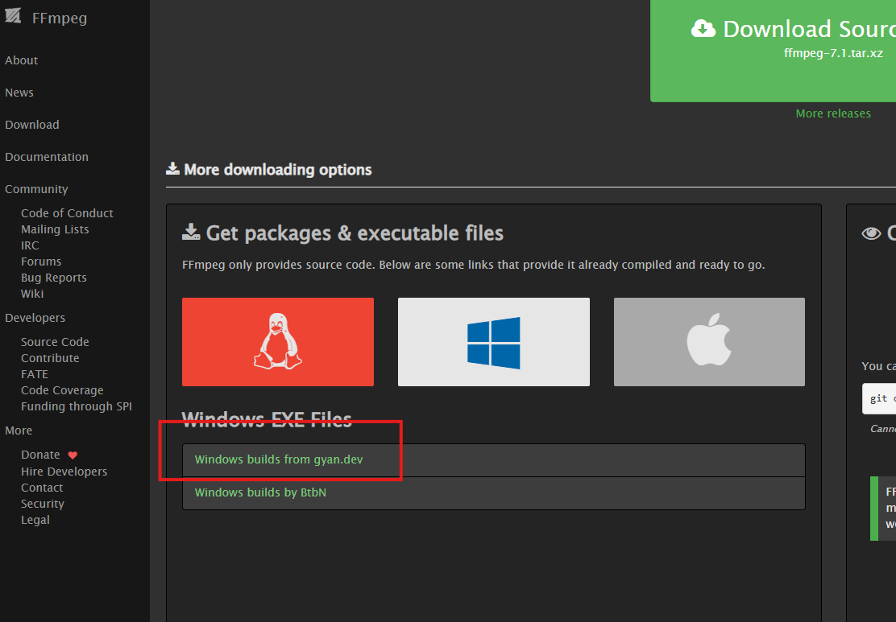
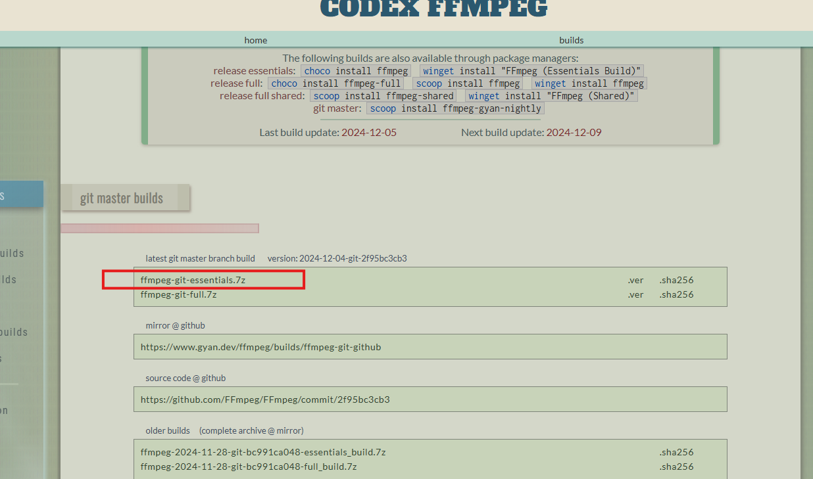
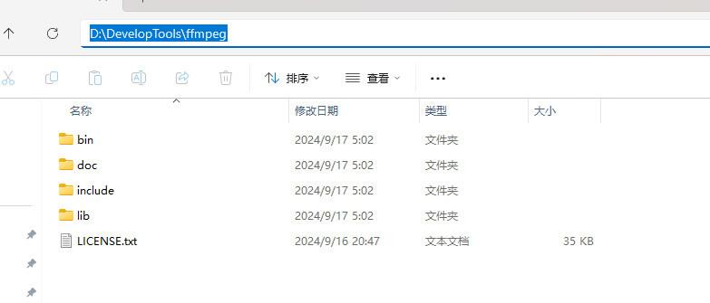
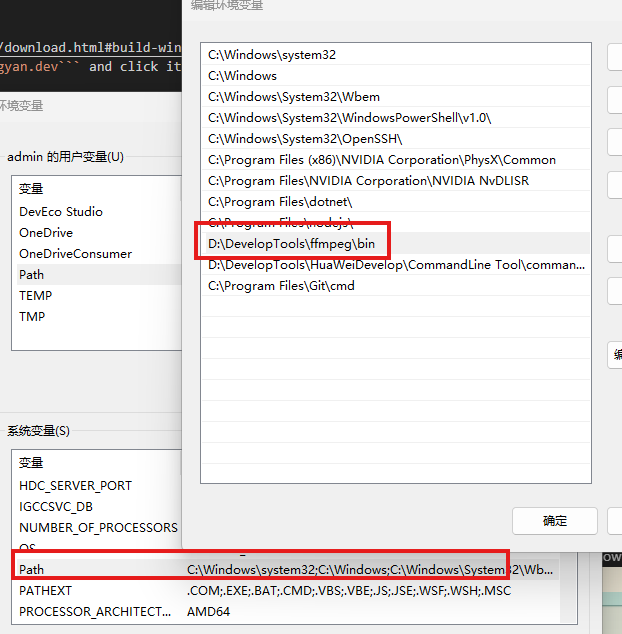
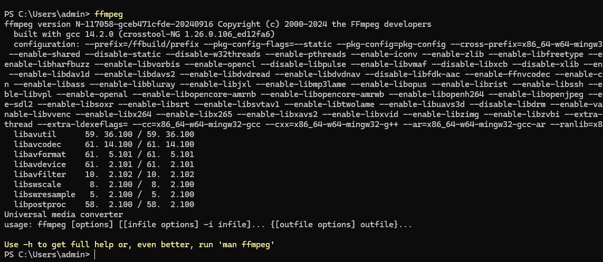

# MergeTSFiles
1. Download FFmpeg
a. Go to https://www.ffmpeg.org/download.html#build-windows.
b. Find 'Windows builds from gyan.dev' and click it to the package page.


c. Find and download 'ffmpeg-git-essentials.7z' on the new page.


2. Unzip the downloaded File 'ffmpeg-git-essentials.7z' to a new folder. Such as 'D:\DevelopTools\ffmpeg'.


3. Config environment --> System --> Path
Add a new path 'D:\DevelopTools\ffmpeg\bin'.


4. Key in ffmpeg in command line to check if the configuration is successful.



Notice: Refer to: ```https://blog.csdn.net/fly_view/article/details/129793212```

```python
pip install ffmpy3
```
